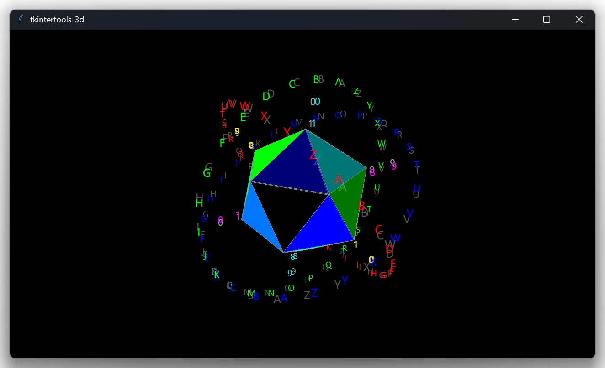

<h1 align="center">maliang-three</h1>

<p align="center"><a title="Official Website" href="https://xiaokang2022.github.io/maliang/">https://xiaokang2022.github.io/maliang/</a></p>

<p align="center">Extension package of <code>maliang</code> for simple 3D drawings</p>

<p align="center">
<a href="https://github.com/Xiaokang2022/maliang-three/releases"></a>
<a href="https://pypistats.org/packages/maliang-three"></a>
<a href="https://pepy.tech/project/maliang-three"></a>
<a href="https://github.com/Xiaokang2022/maliang-three"></a>
<br/>
<a href="https://github.com/Xiaokang2022/maliang-three/watchers"></a>
<a href="https://github.com/Xiaokang2022/maliang-three/forks"></a>
<a href="https://github.com/Xiaokang2022/maliang-three/stargazers"></a>
<a href="https://github.com/Xiaokang2022/maliang-three/issues"></a>
<a href="https://github.com/Xiaokang2022/maliang-three/pulls"></a>
<a href="https://github.com/Xiaokang2022/maliang-three/discussions"></a>
</p>

<p align="center">
<a href="https://github.com/Xiaokang2022/maliang-three/pulse"></a>
</p>

<p align="center">
    <a href="https://star-history.com/#Xiaokang2022/maliang-three&Date">
        <picture>
            <source media="(prefers-color-scheme: dark)" srcset="https://api.star-history.com/svg?repos=Xiaokang2022/maliang-three&type=Date&theme=dark" />
            <source media="(prefers-color-scheme: light)" srcset="https://api.star-history.com/svg?repos=Xiaokang2022/maliang-three&type=Date" />
            
        </picture>
    </a>
</p>

📦 Installation
----------------

```bash
pip install maliang-three
```

### 👀 Preview



```python
import itertools
import math
import statistics

import maliang
from maliang import theme, three

root = maliang.Tk(title="maliang-three")
space = three.Space(auto_zoom=True, free_anchor=True, keep_ratio="min")
space.light.update(bg="white")
space.dark.update(bg="black")
space.configure(bg="black" if theme.get_color_mode() == "dark" else "light")
space.place(width=1280, height=720, x=640, y=360, anchor="center")
space.update()  # NOTE: This line is very important!

### Inside ###

m = 150 * math.sqrt(50 - 10*math.sqrt(5)) / 10
n = 150 * math.sqrt(50 + 10*math.sqrt(5)) / 10
points = []
dis_side = (
    150
    * (3 * math.sqrt(3) + math.sqrt(15))
    / 12
    / ((math.sqrt(10 + 2 * math.sqrt(5))) / 4)
)
count, color_lst = 0, ["00", "77", "FF"]
colors = [f"#{r}{g}{b}" for r in color_lst for g in color_lst for b in color_lst]

for i in m, -m:
    for j in n, -n:
        points.append([0, j, i])
        points.append([i, 0, j])
        points.append([j, i, 0])

for p in itertools.combinations(points, 3):
    dis = math.hypot(*[statistics.mean(c[i] for c in p) for i in range(3)])
    if math.isclose(dis, dis_side):
        three.Plane(space, *p, fill=colors[count], outline="grey")
        count += 1

### Outside ###

r = 250

O = three.Point(space, (0, 0, 0), fill='white', size=3)
X = three.Line(space, (0, 0, 0), (1, 0, 0), fill='')
Y = three.Line(space, (0, 0, 0), (0, 1, 0), fill='')
Z = three.Line(space, (0, 0, 0), (0, 0, 1), fill='')

ring: dict[str, list[three.Text3D]] = {'x': [], 'y': [], 'z': []}
line: dict[str, list[three.Text3D]] = {'x': [], 'y': [], 'z': []}

for i in range(26):
    t = chr(65+i)
    φ = i/26 * math.tau
    c1 = r * math.sin(φ)
    c2 = r * math.cos(φ)
    ring['x'].append(three.Text3D(space, (0, c1, c2), text=t, fill='red'))
    ring['y'].append(three.Text3D(space, (c1, 0, c2), text=t, fill='forestgreen'))
    ring['z'].append(three.Text3D(space, (c1, c2, 0), text=t, fill='royalblue'))

for i in range(10):
    t = str(i)
    c = (i+1) * 500/11 - r
    line['x'].append(three.Text3D(space, (c, 0, 0), text=t, fill='#00FFFF'))
    line['y'].append(three.Text3D(space, (0, c, 0), text=t, fill='#FF00FF'))
    line['z'].append(three.Text3D(space, (0, 0, c), text=t, fill='#FFFF00'))


def text_animation() -> None:
    """Make the Text spin."""
    for obj3D in ring['x']:
        obj3D.rotate(0.05, axis=X.coordinates)
    for obj3D in ring['y']:
        obj3D.rotate(0.05, axis=Y.coordinates)
    for obj3D in ring['z']:
        obj3D.rotate(0.05, axis=Z.coordinates)
    for obj3D in line['x']:
        obj3D.rotate(-0.05, axis=Y.coordinates)
    for obj3D in line['y']:
        obj3D.rotate(-0.05, axis=Z.coordinates)
    for obj3D in line['z']:
        obj3D.rotate(-0.05, axis=X.coordinates)
    for obj3D in space.components:
        obj3D.rotate(0, -0.01, 0.01, center=O.center())
        obj3D.update()
    space.space_sort()
    root.after(10, text_animation)


text_animation()
root.mainloop()
```
